# Thesis Idea Map — V2G / Bidirectional Charging for Heavy-Duty Truck Depots
### TRATON / MAN R&D · "UnPlugged Energisers" · Efficient Transport
**Prepared:** 19 June 2026 · Author context: M.Sc. Automotive Engineering, RWTH Aachen · 7–8 month thesis window

> This document is written for *you* to imagine and choose. It is opinionated. Each idea has a flow diagram
> (Mermaid — renders in GitHub, VS Code "Markdown Preview Mermaid Support", Obsidian, Typora). At the end there is
> a single **recommended fused thesis** with a timeline, plus the questions we need to answer to lock the scope.

---

## 0. The one thing that changes everything: *your* unfair advantages

Most V2G theses are written by people who have **none** of the three assets you have. Your novelty should be built
on these, not on "a bigger model":

| Asset | Why it is rare | What it unlocks |
|---|---|---|
| **You sit inside the OEM that writes the battery warranty** | Academics model the *owner's* fear ("will V2G void my warranty?"). Nobody optimizes from the *OEM's* side, where the warranty is a **design variable**. | Warranty-budget-coupled dispatch + warranty *product* co-design (Idea 2). |
| **Real truck + charger + a few days of real V2G** | Almost every degradation model in V2G optimization is calibrated on **lab cells** (18650 / small pouch), then scaled. Nobody closes the loop on a real HD pack under *commanded* V2G. | Sim-to-real calibration / residual learning (Idea 1) — this is your credibility anchor. |
| **EU + China is in your job description** | Most comparisons are descriptive tables. | A reusable **policy compiler** (Idea 5) — an internal TRATON market-entry tool, not just a thesis chapter. |

**Hard truth on novelty (verified against current literature):** "Add a battery-aging layer," "build a digital twin,"
"do MPC instead of MILP," "compare NMC vs LFP," and "chance-constrained FCR bidding" are **all already published**.
A thesis that only does those is *good engineering, weak research*. The novelty has to live in a **new decision
function**, and the digital twin must be demoted to "the validation environment," not "the contribution."

---

## 1. The layered platform (your digital twin = the *lab*, not the *result*)

Build this once. Every idea below is a *function* that plugs into it. This framing lets you honestly say "the twin is
the apparatus; my contribution is function X tested in it."

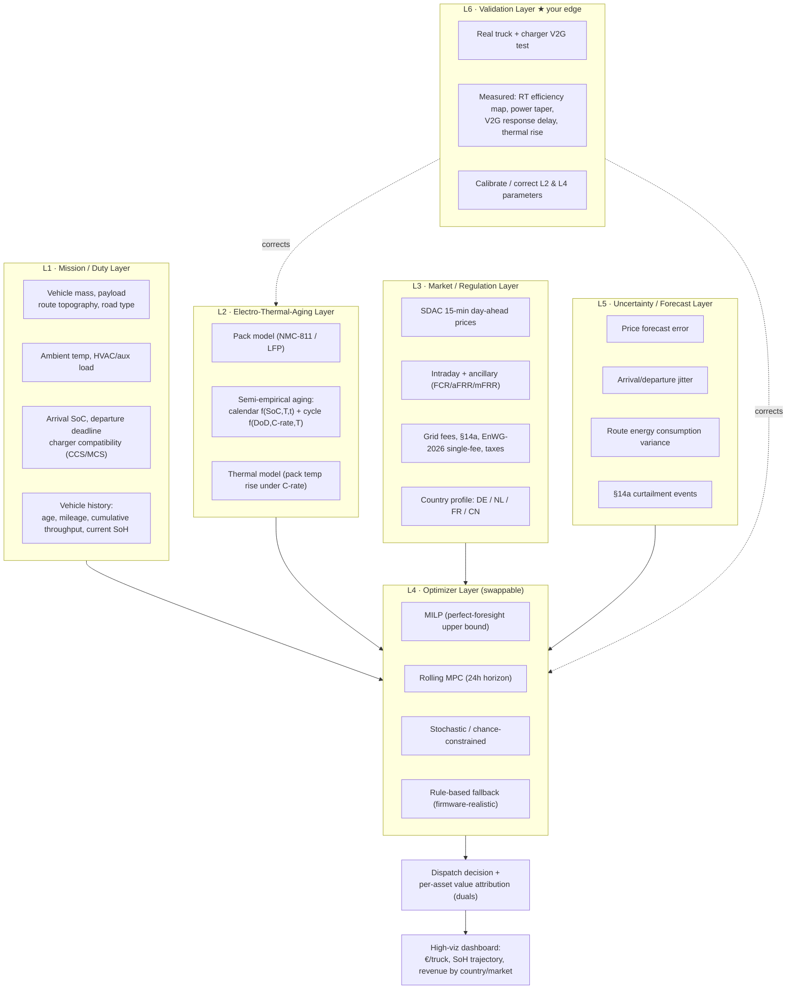

---

## 2. The ideas (ranked, each with a flow diagram)

Ordering = my recommendation for **novelty × feasibility × TRATON value**, given your assets.

---

### ⭐ Idea 1 — Sim-to-Real "Degradation Twin Calibration" (your credibility anchor)

**The gap:** V2G economics swing entirely on the degradation cost per kWh. Yet that number is almost always taken from
**lab cells** and assumed to transfer to a 400+ kWh truck pack. It does not — pack-level thermal gradients, BMS
balancing, contactor/inverter losses and real C-rate tapers differ. Nobody has published a **measured-stress →
degradation** calibration for a real *heavy-duty* pack under *commanded* bidirectional events.

**The new function:** A calibration layer that runs your few-day V2G test, extracts the *measured* stress signatures
(RT-efficiency map, power taper curve, V2G command→delivery delay, pack temperature rise per C-rate), and computes the
**residual** between your in-house lab aging model's prediction and the real pack behaviour. Output: a *corrected,
truck-specific* degradation cost surface that the optimizer then uses.

**Why TRATON cares:** Every euro of the V2G business case rests on this number. You turn an *assumed* parameter into a
*measured* one — de-risking the entire Energisers value proposition. This is the part of the thesis that *only you* can do.

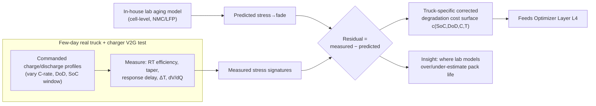

**Feasibility:** HIGH for the *stress-signature* measurement (efficiency, taper, delay, thermal — measurable in days).
MEDIUM for *capacity-fade* measurement (true fade needs weeks/months — so you measure *stress proxies*, not fade itself,
and validate that the proxies match the model's inputs). Be honest about this in the thesis; it is still novel.

---

### ⭐⭐ Idea 2 — Warranty-Budget-Coupled V2G Dispatch (the OEM-only idea)

**The gap (verified):** Existing warranty+V2G work is **owner-side** — "performance guarantees," "will my capacity drop."
The **OEM-side** question is unaddressed: *MAN writes the warranty* (e.g., 80% SoH at N years **or** Y kWh throughput,
whichever first). V2G *spends* that warranty budget. How should the optimizer treat **remaining warranty throughput as a
depletable, shadow-priced resource** — and what **warranty product structure** makes V2G net-positive for *both* MAN and
the fleet operator? This couples **controller design to contract design**. That coupling, for HD trucks, from the OEM
seat, is genuinely open.

**The new function:** Add a warranty-state variable `W(t)` (remaining guaranteed throughput / equivalent full cycles).
Each V2G kWh draws down `W`. The MILP/MPC dual on the `W`-constraint is the **shadow price of warranty** — the true
marginal cost of cycling. Then run **contract co-design**: simulate warranty products (flat, throughput-metered,
"V2G-miles," reservation-only for NMC) and find which maximizes joint OEM+fleet surplus.

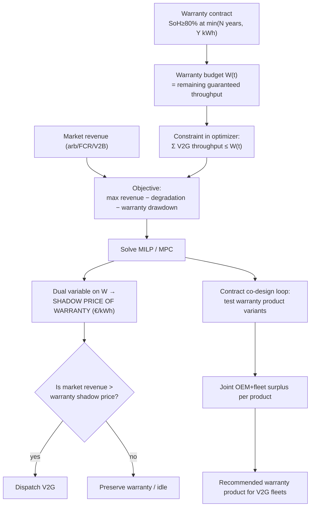

**Why this is the headline:** It is publishable (it reframes V2G as a *contract-bounded* control problem), and it is
directly a **MAN sales + product-policy artifact**: "here is the warranty we should offer V2G fleets, and here is why it
makes money for everyone." Nobody outside an OEM can credibly write this chapter.

---

### ⭐⭐ Idea 3 — Manufacturing Firm Ancillary Capacity by Duty-Cycle Co-Scheduling

**The gap (verified):** FCR needs **firm** capacity over a product window; trucks leave the depot, so naive availability
is too random. Existing EV-FCR papers treat availability as **exogenous** and bid under it with chance constraints
(Nordic, light-duty). Nobody **shapes the logistics** to *create* firm capacity. A *depot* operator can stagger
departures / hold a rotating sub-fleet back to guarantee an always-plugged-in pool — turning availability from a
**constraint into a decision variable**, co-optimized with logistics feasibility, then **VPP-aggregated** across depots
for statistical smoothing.

**The new function:** Joint optimization of `{route/departure feasibility} × {firm FCR capacity commitment}`, with a
reliability target (e.g. P99 that committed MW is deliverable), aggregated over multiple depots.

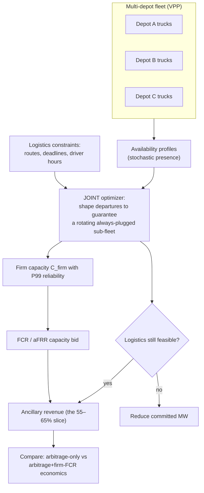

**Feasibility:** MEDIUM–HIGH (data-driven; no extra hardware). **TRATON value:** CRITICAL — ancillary services are the
majority of stationary-storage revenue in Germany; this is the literal product the Energisers team would sell.

---

### ⭐ Idea 4 — Value-of-Fidelity / Minimum-Viable-Twin Study

**The gap:** Everyone adds layers; *nobody asks which layers actually change the decision.* "How much model complexity is
needed before the **dispatch decision and the € outcome stop improving**?" is methodologically elegant and under-studied.

**The new function:** Systematic ablation — strip layers (hourly vs 15-min, linear vs nonlinear aging, deterministic vs
stochastic, calendar aging on/off, thermal on/off) and measure the **decision regret** and **€ error** each adds.

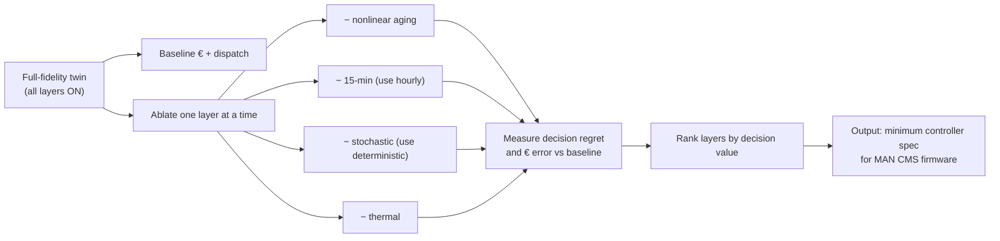

**Why TRATON cares:** Directly answers "what must our on-board/CMS optimizer actually compute vs. academic decoration?"
This is a *firmware specification* deliverable. Excellent as a **supporting chapter** to Idea 1/2.

---

### ⭐⭐ Idea 5 — EU↔China "Policy Compiler" (required by your job, made novel)

**The gap:** Country comparisons are descriptive. Make it a **compiler**: input tariff structure + regulation + battery
mix → output an **optimizer configuration** (which strategy layers are profitable, in what order) + a single normalized
**Charging-Cost-Structure Index** ranking markets.

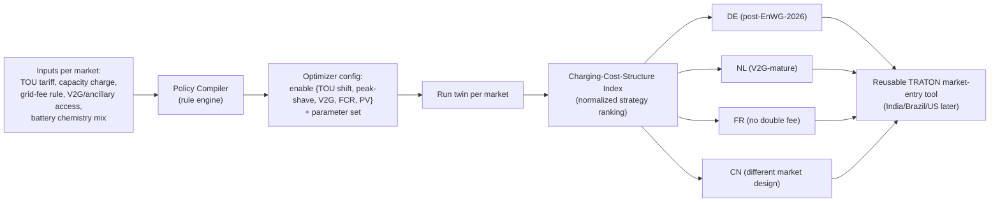

**Why TRATON cares:** Becomes an **internal benchmarking tool**, reusable for any future market — far more than a thesis
table. Strong as the **breadth chapter** alongside a deep core idea.

---

### Idea 6 — Per-Truck Flexibility-Value Attribution ("shadow-price bill")

**The gap:** Fleet operators get one bill and cannot see *which truck* caused cost. MILP **dual variables** give the
marginal cost contribution of each truck/charger/chemistry **for free** in every solve — but no tool surfaces them as
operational intelligence.

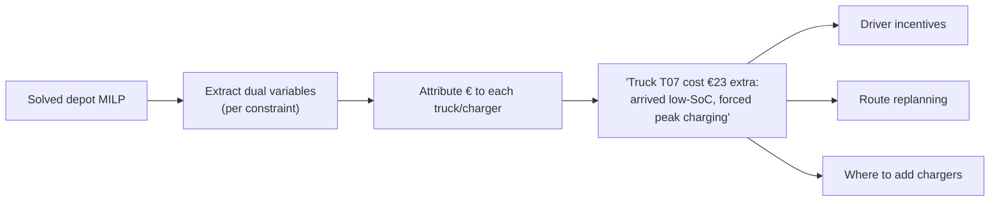

**Verdict:** Lovely **product feature** and a clean "novel output" deliverable, but thin as a *standalone* thesis. Use it
as the **interpretable-output layer** of Idea 2 (the warranty shadow price is the same mathematics). This is your
"function developer" deliverable.

---

### Idea 7 — Future-Scenario Stress Layer (2030 / 2040 / 2050)

**The gap / correct framing:** Don't predict "free electricity in 50 years." The literature points to **lower average
wholesale prices but more frequent zero/negative-price hours and higher short-term volatility** under deep
renewables. A V2G controller's value then shifts from *price minimization* to *volatility & surplus-window timing*.

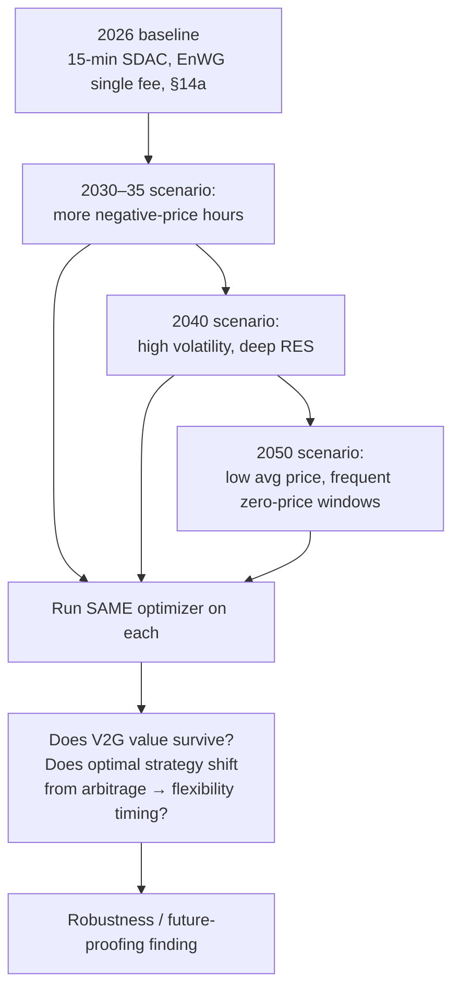

**Verdict:** Great **discussion / future-work chapter** that makes the thesis feel forward-looking. Keep it as scenarios,
not predictions. Not a standalone thesis.

---

## 3. Novelty & priority matrix

| # | Idea | Novelty | Feasibility (7–8 mo) | TRATON value | Needs real truck? | Role |
|---|---|---|---|---|---|---|
| 1 | Sim-to-real degradation calibration | **High** | Med–High | **High** (de-risks business case) | **Yes** | Validation anchor |
| 2 | Warranty-budget-coupled dispatch | **Very High** | Medium | **Critical** (OEM product/policy) | Helpful | **Headline** |
| 3 | Firm ancillary via duty-cycle co-sched | **High** | Med–High | **Critical** (revenue) | No | Strong core/stretch |
| 4 | Value-of-fidelity / min-viable twin | High | High | High (firmware spec) | No | Supporting |
| 5 | EU↔China policy compiler | Medium–High | High | High (market entry) | No | Breadth chapter |
| 6 | Per-truck shadow-price attribution | Medium–High | High | High (product feature) | No | Output layer |
| 7 | Future-scenario stress | Medium | High | Medium | No | Discussion |

---

## 4. ⭐ Recommended fused thesis

> **"Warranty-Aware, Empirically-Calibrated V2G Dispatch for Heavy-Duty Truck Depots — with a Cross-Market (EU/China) Decision Compiler"**

This fuses **Idea 2 (headline novelty) + Idea 1 (your real-truck credibility anchor) + Idea 6 (interpretable output) +
Idea 5 (breadth, job requirement)**, with **Idea 4** as a tight supporting chapter and **Idea 3 / Idea 7** as clearly
labelled stretch / future work. It is sharp, OEM-unique, uses every one of your unfair advantages, and is defensible to
both RWTH and TRATON.

**The single research question:**
> *How should a heavy-duty truck depot dispatch V2G when the battery warranty is a depletable, shadow-priced contractual
> resource — and what warranty product makes V2G net-positive for both the OEM and the fleet — validated against measured
> behaviour of a real truck pack and generalized across EU and Chinese market structures?*

**Contribution stack:**
1. **Method:** warranty-budget state + shadow-price-of-warranty in the optimizer (new).
2. **Empirics:** real-truck stress calibration correcting the in-house aging model (new, your edge).
3. **Product/policy:** warranty-product co-design → recommended V2G warranty for MAN (new, OEM-only).
4. **Generalization:** EU/China policy compiler + per-truck value attribution (reusable tools).

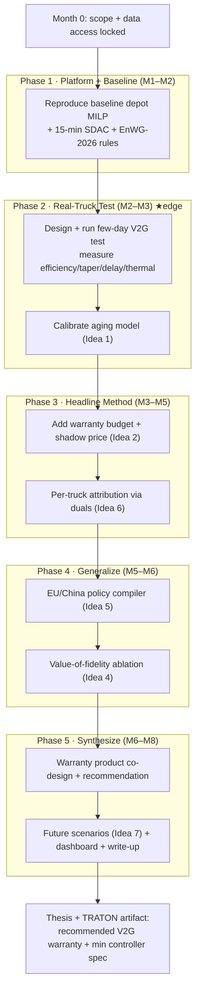

**8-month timeline (Gantt):**

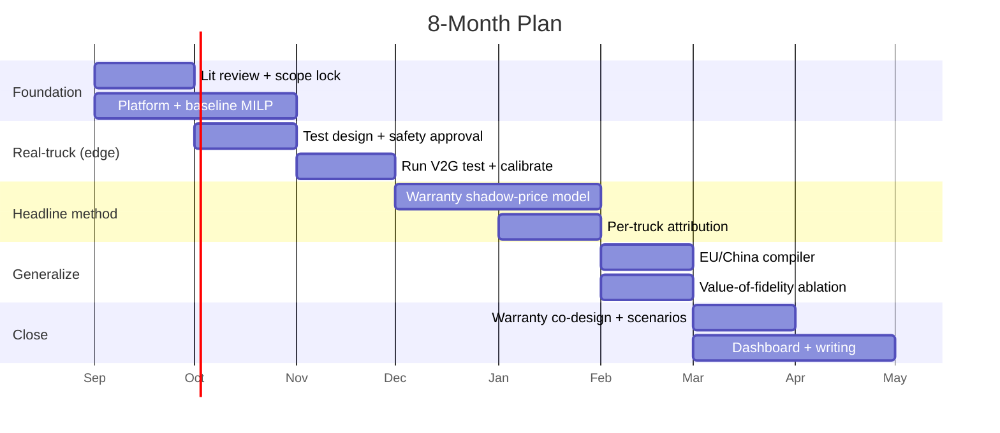

---

## 5. EU ↔ China dimension (concrete, not a table of clichés)

Compile each market into an optimizer config; key axes that actually change the dispatch:

- **Grid-fee treatment of stored-then-returned energy** — DE just fixed this (single fee from Jan 2026, ⚠ initially tied
  to own-PV users); FR already favorable; CN differs by province.
- **Market time resolution** — EU SDAC is 15-min (since Oct 2025); China's spot pilots differ by province.
- **Ancillary access for aggregated EV fleets** — who can prequalify, minimum bid size, symmetric vs asymmetric.
- **Capacity/demand charge structure** — drives peak-shaving value (German *Leistungspreis* on peak 15-min).
- **Battery chemistry mix** — China fleets skew **LFP** (more V2G-tolerant); EU MAN packs skew **NMC** (calendar-aging
  sensitive). The *same* optimizer should behave differently → this is a clean result, not just description.

---

## 6. Real-truck test plan (keep it surgical — days, not fade)

You cannot measure capacity fade in a few days. Don't try. Measure the **inputs** your model assumes, and prove/correct them:

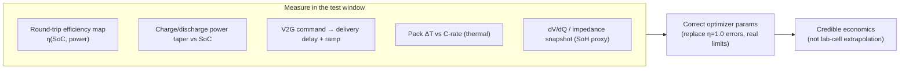

**This single step kills the most common reviewer criticism** ("your efficiencies/limits are assumed"). It is the
cheapest, highest-credibility part of the whole thesis.

---

## 7. Questions I need answered to lock the final scope

These genuinely change the plan — please answer the ones you can:

1. **Warranty access:** Can you get MAN's *actual* eTruck battery warranty terms (SoH threshold, year/throughput limits)?
   Idea 2 (the headline) needs this. If not, can we use a representative anonymized version?
2. **Bidirectional test freedom:** Free to command arbitrary charge/discharge profiles, or only a tightly-scripted pilot?
   This decides how rich the calibration (Idea 1) can be.
3. **Telematics resolution:** Charger + truck logs at ≤1-min resolution? Needed for taper/delay/thermal capture.
4. **Pack history:** Do you have age, mileage, cumulative throughput, present SoH for the test truck? Enables the
   "history-aware" angle.
5. **In-house aging model:** Can you see/modify its equations (semi-empirical params), or is it a black box? Decides
   whether calibration is "correct the params" or "wrap a residual model around it."
6. **Deliverable type:** Should the final artifact lean **publishable method paper**, **TRATON internal prototype/tool**,
   or **future product concept**? (Affects how much weight goes to compiler/dashboard vs. the method.)

---

## 8. Honest bottom line

- **Don't** build "a giant Simulink twin" as the contribution — it's an apparatus, and reviewers know it.
- **Do** make the headline a *new decision function* only you can write: **warranty as a shadow-priced budget from the
  OEM seat (Idea 2)**, made credible by **real-truck calibration (Idea 1)**, generalized by the **EU/China compiler
  (Idea 5)**, and made tangible by **per-truck shadow-price attribution (Idea 6)**.
- **Stretch goal / second paper:** firm ancillary capacity via duty-cycle co-scheduling (Idea 3).

---

## 9. Review & critique of the "five-family" thesis map (second agent)

A second agent proposed five thesis families + diagrams. It is a **well-structured, lower-risk** map — but read
honestly it is **lower-novelty** than the warranty angle (§4), because four of the five families integrate
*already-published* building blocks. Two of its diagrams also bake in a subtle mistake. Verdict: it is the perfect
**backbone**; my warranty + real-truck ideas are the **novel layer** on top (see §10).

**Reconciliation:**

| Second-agent family | Overlaps | Standalone novelty | Verdict |
|---|---|---|---|
| 1 · Chemistry-adaptive optimizer | (twist needed) | Low–Med (NMC-vs-LFP well-published) | Amend → **life-stage-adaptive** rules |
| 2 · MPC + digital twin | Platform §1 + Idea 4 | Low (MPC twins exist) | Anchor with **value-of-fidelity** |
| 3 · V2G + FCR feasibility | Idea 3 | Med | Shift to **manufacturing** firm capacity |
| 4 · Multi-depot VPP | Idea 3 | Med | Strong but **data-gated** |
| 5 · Europe–China | Idea 5 | Low alone | Make it the **policy compiler**; not standalone |

**Family 1 — Chemistry-adaptive.** *Critique:* static "NMC=conservative, LFP=broad" is a lookup table, not research.
*Amendment:* make rules **evolve with SoH** — an aging NMC pack becomes "LFP-like" and tolerates deeper cycling, so the
optimizer's *constraint set itself* changes over life. Few papers let aging reshape the optimizer's own rules.

**Family 2 — MPC + twin.** *Critique:* textbook MPC loop; HD-truck MPC twins are already published. *Amendment:* keep as
apparatus, make the *question* the **value-of-fidelity ablation** (Idea 4) → a firmware spec, not just a tool.

**Family 3 — V2G+FCR.** *Critique / subtle mistake:* the diagram starts from a **given** availability model and only
*checks* headroom — exactly the exogenous-availability assumption of published Nordic FCR work. *Amendment:* a depot can
**shape** the duty cycle to *manufacture* firm capacity → availability becomes a **decision variable** (Idea 3). Keep
the MCS/CCS branch (Scania has demonstrated bidirectional V2G over MCS) as a power-limit parameter.

**Family 4 — Multi-depot VPP.** *Critique:* sound but **data-hungry**; statistical smoothing is well understood.
*Amendment:* if no real multi-site data, synthesize from one depot's distributions and frame as "how many depots of what
profile firm up an X-MW FCR product" — fuses with Family 3; allocation step uses the dual/shadow-price machinery (Idea 6).

**Family 5 — Europe–China.** *Critique:* ends at "compare which wins where" = descriptive. *Amendment:* make it an
automatic **policy compiler** ending in a normalized **Charging-Cost-Structure Index** → reusable tool (Idea 5).

**On its recommended core** (*chemistry- and market-aware hierarchical optimizer*): a genuinely strong, low-risk systems
thesis — but its novelty is *integration*, the most contested form of novelty in front of an examiner. Strongest of its
titles is *"From Depot Charging to Grid Services…"* because it promises a result, not just a system.

## 10. ⭐ Synthesis verdict — use both maps

Take the second agent's **hierarchical optimizer as the backbone** (concrete, feasible, maps to your existing aging code)
and bolt on my **novel layer** (warranty shadow-pricing + real-truck calibration) so the contribution is a *new function*,
not just a well-integrated system.

- **Backbone:** day-ahead MILP → 15-min MPC, life-stage-adaptive chemistry rules, optional safe V2G/FCR.
- **Novel layer:** warranty shadow-price (Idea 2), real-truck calibration (Idea 1), per-truck attribution (Idea 6).
- **Breadth:** EU/China policy compiler (Idea 5), value-of-fidelity ablation (Idea 4).

**Decision rule:** want *lower risk + working system* → lead with the backbone, warranty shadow-pricing as the novel
chapter. Want *maximum novelty/publishability* → lead with the warranty function, optimizer as supporting machinery.
Same artifacts either way; only emphasis changes. The deciding factor is §7 — above all **whether you can get MAN's real
warranty terms and free bidirectional test access.**

---

## 11. NEW IDEAS (your latest thinking) + the diesel-era lens

### The diesel-era analogies (why they generate good research)

Real impact in the combustion era came from turning *experience* into *parametric maps and records* that everyone
downstream could use. Three of those map directly onto your battery problem:

| Diesel/petrol era | Battery-era equivalent | What it unlocks |
|---|---|---|
| **Verbrauchskennfeld** (engine fuel/efficiency map from dyno tests) | **V2G-degradation map** of the pack (fade vs C-rate, SoC window, temp, #sessions) | Charger reads the map and throttles V2G as the pack ages |
| **Scheckheft / service logbook** | **Battery passport** (lifecycle history per pack) | Any charger the truck visits knows the pack's history |
| **Knock control** (retard ignition near the knock limit) | **Plating-limit control** (back off C-rate near the Li-plating limit, adaptively as the pack ages) | Protect the anode automatically without losing performance |

### Idea 8 — Battery Passport as a *live control input* (closed-loop), not just compliance

**Verified context:** EU Digital Battery Passport is mandatory from **Feb 2027** for batteries >2 kWh; DIN DKE SPEC
99100 (Feb 2025) defines the data attributes; SoH must be reported (energy-based, "SOCE"). **But** the passport is
updated only on *material change* (refurbishment, ownership transfer, major maintenance) — it is a **periodic
compliance record, not a real-time control signal.**

**The gap (genuinely open for HD trucks):** nobody has connected the passport as a **live input to the charger/depot
optimizer** that, on plug-in, reads the pack's history and *decides* C-rate, SoC window, and V2G go/no-go — then
**writes the session back** (closed loop). This is the industrial product MAN/TRATON could own.

**Why it unifies the whole thesis:** the passport's SoH field *is* the warranty-budget state `W(t)` (Idea 2); the
pack history *is* what the life-stage-adaptive rules need (amended Family 1); the written-back sessions *are* the data
that calibrate the degradation map (Idea 1). The passport is the **data backbone** that ties Ideas 1, 2, 6 and the
life-stage rules together.

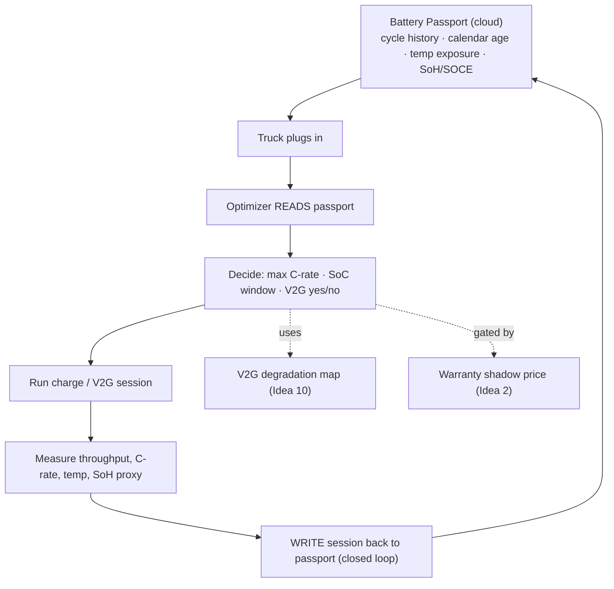

**Honest cautions:** the standard's SoH is coarse and updated infrequently → for live control you rely on the *BMS*
SoH, with the passport as the cross-charger, cross-owner record. Data ownership and interoperability across charging
networks ("everywhere the truck goes") is the vision; **depot-only closed loop is the realistic thesis scope**, with
roaming as discussion/future work.

### Idea 9 — Your controlled range/SoH degradation test (validated, then corrected)

**Your instinct is right and the framing is excellent** (drive 60%→50%, run a V2G block, re-drive 60%→50%, compare
the km). It is the battery version of a controlled dyno test. But as a *pure road-range* test in a short window it has
three problems you must fix, or you will measure noise instead of degradation:

1. **The signal is below the noise floor.** The best real study (220 V2G cycles over 3 years) saw **no statistically
   significant** V2G fade — both test and control cars lost ~8%, dominated by *calendar* aging. A single 4-hour V2G
   block changes capacity by *thousandths of a percent*. You cannot see that in road kilometres.
2. **Road range is extremely noisy.** Payload, wind, traffic, temperature, regen, tyre pressure, driver, HVAC each move
   range by several percent — swamping any real fade signal.
3. **Reversible effects masquerade as degradation.** Right after a V2G block the pack is *warm and polarised*. An
   immediate re-drive differs because of **temperature and relaxation**, not aging. Without a rest/thermal-equalisation
   step you would measure reversible physics, not lifetime loss.

**The corrected, rigorous version** (keep the story, instrument it properly): use the drive as the *communicable*
output, but measure **direct electrical SoH metrics** that are orders of magnitude more sensitive than range, and
control thermal state:

| Step | Do | Measure (the sensitive bit) | Control |
|---|---|---|---|
| Reference test (pre) | Controlled partial-discharge in a fixed SoC window | **Capacity by coulomb-counting**, **DC internal resistance via current pulses (HPPC)**, **dV/dQ (incremental capacity)** | Same temperature, rested pack |
| Optional drive | 60%→50% on a fixed route | Distance (the intuitive proxy) | Same route, payload, temp, driver |
| V2G block | 4 h bidirectional at *known* C-rate / SoC window / temp | Throughput, peak C-rate, avg temp, SoC trajectory | Log BMS @ ≥1 Hz |
| Rest | Thermal + voltage relaxation | — | Return to reference temp before re-test |
| Reference test (post) | Repeat the controlled reference test | Same metrics → **Δresistance, Δcapacity** | Identical conditions |

**What you actually get:** not "fade per block" (too small to see directly) but **the stress signatures** (efficiency,
resistance, thermal response, C-rate) that *calibrate the parameters* of a semi-empirical model
`Q_fade = a·√t·exp(−Ea/kT)·f(SoC) + b·N·g(DoD,C)`. The model then **extrapolates** to year 1/3/5/10 — including a
"max permissible V2G sessions per day vs target lifetime" curve. This is exactly Idea 1, and you arrived at it
independently. ✅

### Idea 10 — The V2G-degradation map (the battery "Verbrauchskennfeld")

**The product-shaped deliverable:** a parametric *surface* `degradation = F(C-rate, SoC window, temperature, #sessions)`
for a real MAN HD pack (NMC, and LFP if available), fitted from Idea 9's tests. The charger reads this map (via the
passport) and **automatically throttles V2G as the pack ages** — just as the diesel fuel map let any controller predict
behaviour at any operating point.

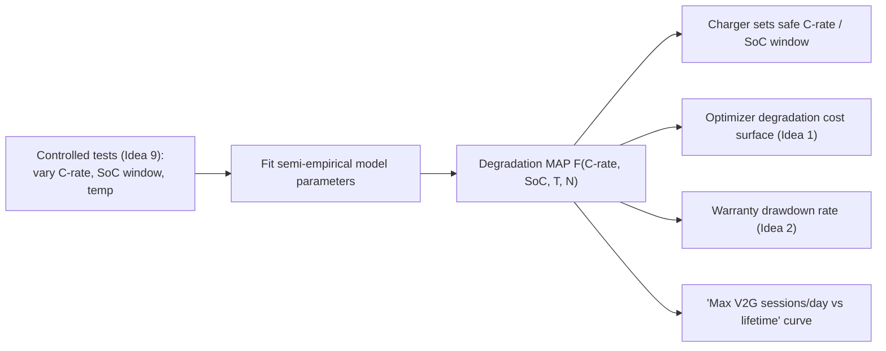

### Idea 11 — Decision matrix for customers *and* governments

**Your fresh idea:** hold the aging + optimization layers *fixed*, then sweep **truck type × mission × cell chemistry ×
country**, and read off who wins where. Output two artifacts:

- **Customer decision matrix:** "for mission X in country Y, chemistry Z + strategy W gives best TCO / lowest fade."
- **Government/regulator view:** "market design A leaves €N/truck/year of flexibility value unrealised vs design B" —
  an evidence base for amendments.

**Critique:** strong as the *results engine* on top of a validated platform, but beware the **combinatorial explosion** —
use a proper Design-of-Experiments (fractional factorial), not brute force. Fuses naturally with the policy compiler
(Idea 5).

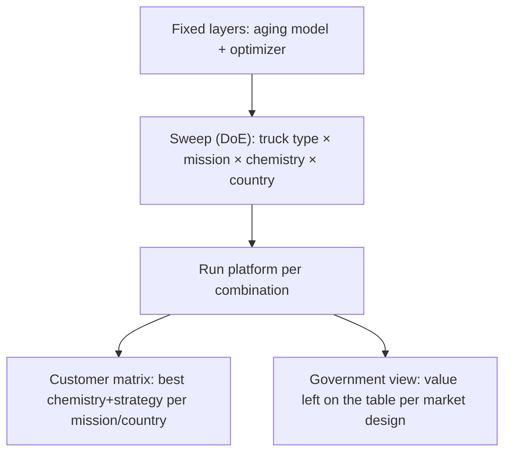

## 12. ⭐⭐ THE MIXED THESIS (everything, unified)

All of this converges on one coherent, genuinely novel, OEM-unique thesis:

> **"The Battery-Passport-Informed Charging Controller: a closed-loop heavy-duty depot optimizer that reads live battery
> history, applies a measured V2G-degradation map, prices warranty consumption, and writes each session back —
> validated on a real MAN truck and generalised into a customer/government decision matrix across missions, chemistries
> and countries."**

The pieces and how they snap together:

- **Data backbone:** Battery Passport (Idea 8) — the live history per pack.
- **Physics:** V2G-degradation map (Idea 10), built from your real-truck test (Idea 9 = Idea 1).
- **Economics:** warranty as a shadow-priced budget (Idea 2); SoH field = warranty state.
- **Control:** passport-informed closed-loop optimizer with life-stage-adaptive rules (amended Family 1) on the
  hierarchical MILP→MPC backbone (second-agent core).
- **Output:** per-truck value attribution (Idea 6) + decision matrix (Idea 11) + EU/China compiler (Idea 5).

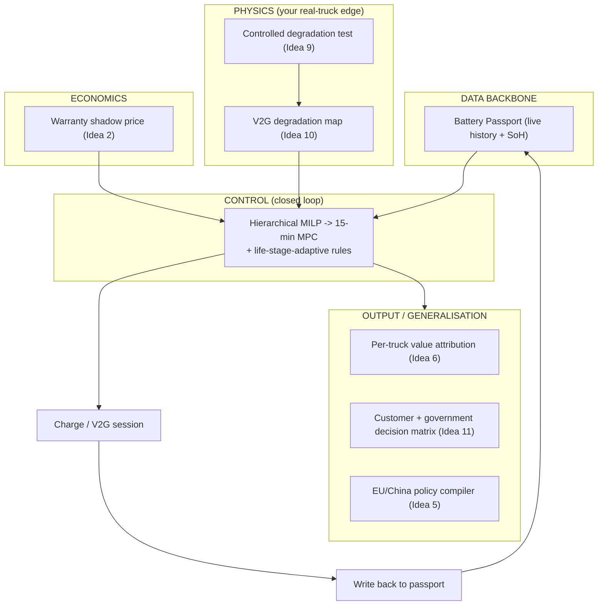

**Why this is defensible:** the digital twin is still just the lab; the **contribution is the closed-loop
passport→map→warranty→control function**, which is new for heavy trucks, timely (passport mandatory 2027, EnWG 2026,
MCS V2G live), and ends in a product MAN can actually ship.

---

### Sources (state-of-the-art & regulatory verification)
- [Extra Throughput vs Days Lost in V2G (arXiv 2024)](https://arxiv.org/html/2408.02139v1) — your N04
- [DIN DKE SPEC 99100 — battery passport data attributes (VDE)](https://www.vde.com/en/press/press-releases/din-dke-spec-99100-battery-pass)
- [New standard for EU digital battery passport (Charged EVs)](https://chargedevs.com/newswire/new-standard-helps-companies-comply-with-eu-digital-battery-passport-requirement/)
- [Why we need standardized SoH measurement for EV packs (npj Clean Energy 2025)](https://www.nature.com/articles/s44406-025-00010-8)
- [V2G impact on battery degradation + economic compensation (Applied Energy 2025)](https://www.sciencedirect.com/science/article/pii/S0306261924019299)
- [Battery performance assessment of V2G-capable EVs — test methodology (EPRI)](https://www.epri.com/research/products/000000003002024770)
- [Economic Viability of V2G Reassessed — degradation-cost LCA (MDPI Sustainability 2025)](https://www.mdpi.com/2071-1050/17/12/5626)
- [Assessing battery degradation in V2G optimization models (Energy Informatics)](https://energyinformatics.springeropen.com/articles/10.1186/s42162-023-00288-x)
- [Empirical capacity measurements of EVs under V2G degradation (ResearchGate)](https://www.researchgate.net/publication/352845601)
- [EV aggregator bidding in Nordic FCR-D: chance-constrained (arXiv 2024)](https://arxiv.org/html/2404.12818)
- [Multi-market V2G revenue incl. FCR (Applied Energy 2025)](https://www.sciencedirect.com/science/article/pii/S0306261925017787)
- [German Parliament removes V2G barrier — EnWG, 13 Nov 2025 (electrive)](https://www.electrive.com/2025/11/14/germany-clears-the-way-for-bidirectional-charging/)
- [Bundestag paves way for bidirectional charging (heise)](https://www.heise.de/en/news/E-mobility-Bundestag-paves-the-way-for-bidirectional-charging-11079628.html)
- [Scania demonstrates V2G through MCS (Charged EVs)](https://chargedevs.com/newswire/scania-demonstrates-vehicle-to-grid-through-megawatt-charging-system-for-heavy-electric-vehicles/)
- [chargebyte CCL MCS — ISO 15118-20 over Ethernet (Charged EVs)](https://chargedevs.com/newswire/chargebytes-ccl-mcs-brings-iso-15118-20-over-ethernet-to-megawatt-charging-for-heavy-duty-evs/)
